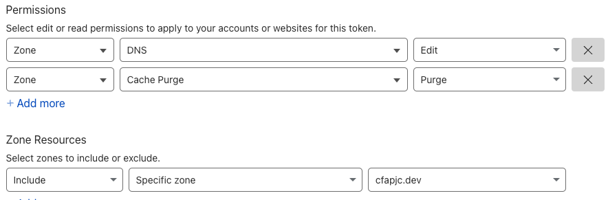

# tf-cf-example

This repository contains example Terraform HCL to create resources in Cloudflare using [version 4.x](https://registry.terraform.io/providers/cloudflare/cloudflare/latest/docs) of the Cloudflare Terraform Provider.

The Terraform in this plan does the following:

- Create's DNS records based on the `terraform.tfvars`
- Purges everything in the Cloudflare Cache using the [HTTP Module](https://registry.terraform.io/providers/hashicorp/http/latest/docs)

Files required in this project:

```bash
├── main.tf
├── outputs.tf
├── providers.tf
├── terraform.tfvars
└── variables.tf
```

# Get started

Follow the steps below to clone the repo and deploy against your account/zone in Cloudflare.

1. Clone the GitHub repository:

```bash
git clone https://github.com/tonysangha/tf-cf-example.git
```

2. Rename `terraform.tfvars.example` to `terraform.tfvars`

3. Create API Tokens in Cloudflare with the following permissions:



4. Update `terraform.tfvars` with the API Token, Zone ID, and DNS records for your project

5. Initialise Terraform project - `terraform init`

6. Apply Terraform - `terraform apply` enter `yes` to accept proposed changes

A successful apply should provide the following output:

```bash
Apply complete! Resources: 3 added, 0 changed, 0 destroyed.

Outputs:

cloudflare_cache_purge = <<EOT
Status code for purge: 200, ID for event: {
  "result": {
    "id": "c926d4f876084532f9d4aa30df950677"
  },
  "success": true,
  "errors": [],
  "messages": []
}

EOT
cloudflare_dns_records_created = {
  "a-record" = "sample.cfapjc.dev"
  "cname-record" = "sample-cname.cfapjc.dev"
  "txt-record" = "sample-txt.cfapjc.dev"
}
```

terraform init
